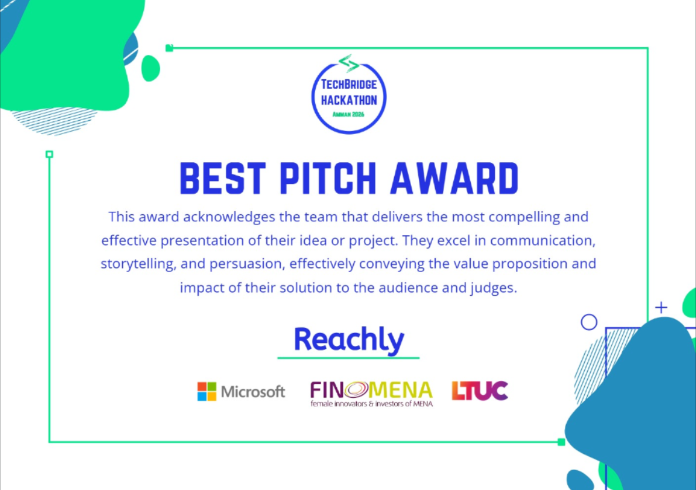
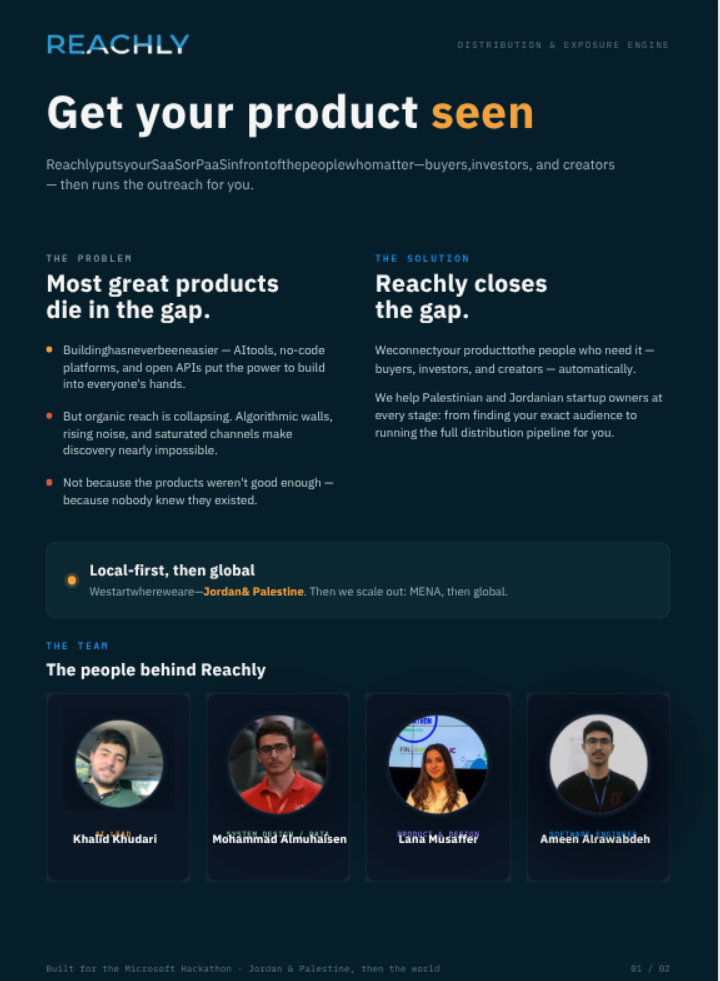
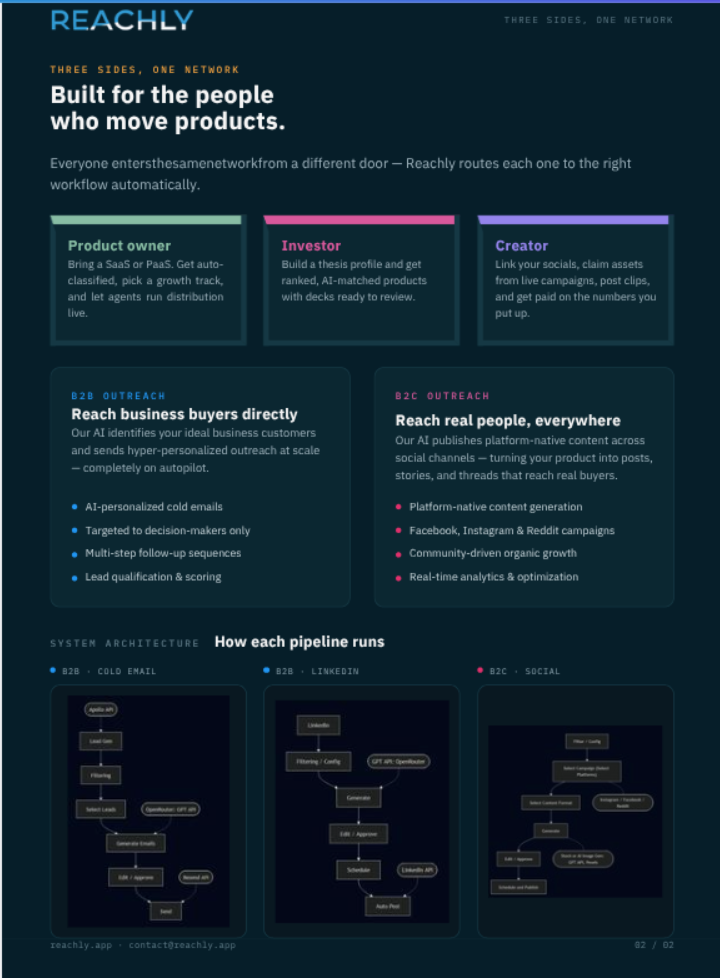
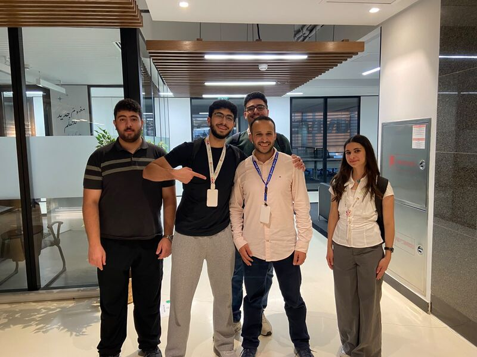

# Reachly

> **AI-powered distribution & exposure engine for B2B and B2C products.**
> Describe your product once, then let agents find buyers, generate channel-native content, schedule it, and guide your GTM strategy.



---

## What is Reachly?

Reachly puts your SaaS or PaaS in front of the people who matter — buyers, investors, and creators — then runs the outreach for you.

Most great products fail not because they aren’t good enough, but because nobody knows they exist. Organic reach is collapsing under algorithmic walls, rising noise, and saturated channels. Reachly closes that gap by automating the full distribution pipeline: from audience discovery to personalized outreach to published content.



### Three sides, one network

Reachly routes each user to the right workflow automatically:

- **Product owners** bring a SaaS/PaaS, get auto-classified, pick a growth track, and let agents run distribution live.
- **Investors** build a thesis profile and get ranked, AI-matched products with decks ready to review.
- **Creators** link their socials, claim assets from live campaigns, post clips, and get paid on performance.



---

## Recognition

🏆 **Best Pitch Award** — TechBridge Hackathon Amman 2026, sponsored by Microsoft, FINOMENA, and LTUC.



---

## Features

### B2B Outreach
- **AI lead scraping** via Apify — identifies your ideal business customers.
- **AI-personalized cold emails** targeted at decision-makers.
- **LinkedIn content generation** for organic thought-leadership campaigns.
- **Multi-step follow-up sequences** and lead qualification.

### B2C Outreach
- **Platform-native content generation** for Instagram, Facebook, and Reddit.
- **Auto-scheduling** on a 7-day calendar with one-click placement.
- **Community-driven organic growth** with post previews matching each network.
- **Real-time analytics & optimization** surface via the AI strategist chat.

### Core Platform
- Single onboarding wizard captures your product once.
- AI strategist chat gives context-aware GTM advice as rich cards.
- Ownership-scoped, multi-tenant data model built in from day one.
- Light/dark mode, responsive dashboards, and serverless deployment on Vercel.

---

## Tech Stack

| Layer | Choice |
|-------|--------|
| Framework | Next.js 16 (App Router, React 19, TypeScript 5) |
| Auth | Better Auth with Drizzle adapter |
| Database | Neon Serverless Postgres |
| ORM | Drizzle ORM + drizzle-kit |
| AI | Vercel AI SDK + OpenRouter (`openai/gpt-4o-mini`) |
| Lead Scraping | Apify (`khadinakbar/universal-lead-finder`) |
| Styling | Tailwind CSS v4 + CSS custom-property design tokens |
| UI Components | Custom components + `lucide-react` icons + `sonner` toasts |
| Validation | Zod |
| Hosting | Vercel |

---

## Getting Started

This project uses `pnpm`.

```bash
# Install dependencies
pnpm install

# Start the development server
pnpm dev
```

Open [http://localhost:3000](http://localhost:3000) in your browser.

### Required Environment Variables

Create a `.env.local` file (or set variables in Vercel):

| Variable | Purpose |
|----------|---------|
| `DATABASE_URL` | Neon Postgres connection string |
| `BETTER_AUTH_SECRET` | Session signing secret |
| `BETTER_AUTH_URL` | Auth base URL — must match your deployed domain |
| `NEXT_PUBLIC_APP_URL` | Trusted origin for cookies — must match your deployed domain |
| `OPENROUTER_API_KEY` | LLM access |
| `APIFY_TOKEN` | Lead-scraping actor auth |
| `APIFY_LEAD_ACTOR` | Override the default Apify actor (optional) |

### Deploy Notes

- Vercel does **not** read `.env.local`; add environment variables in the Vercel dashboard and redeploy.
- `BETTER_AUTH_URL` and `NEXT_PUBLIC_APP_URL` must point at the real deployed domain — using `localhost` on production will break auth cookies.
- Accounts live in the database referenced by `DATABASE_URL`, so local and production DBs are independent.

---

## Project Structure

```
app/
  (auth)/          Login & sign-up
  (onboarding)/    Product setup wizard
  (app)/           Authenticated dashboard (B2B / B2C)
  api/             Route handlers for auth, campaigns, drafts, chat, agents
components/        UI components, post cards, chat, navigation
lib/
  ai/              Product classification & content generation
  apify/           Lead search integration
  db/              Drizzle schema & Neon client
  auth.ts          Better Auth configuration
public/            Static assets & landing page
```

---

## Roadmap

- Replace the static Unsplash image pool with real AI image generation (DALL·E / Stability).
- Move long-running generation and scraping to background jobs via `agent_runs`.
- Real publishing + webhook ingestion for engagement and lead KPIs.
- Add comprehensive test coverage and route-level Zod validation.

---

## License

MIT
