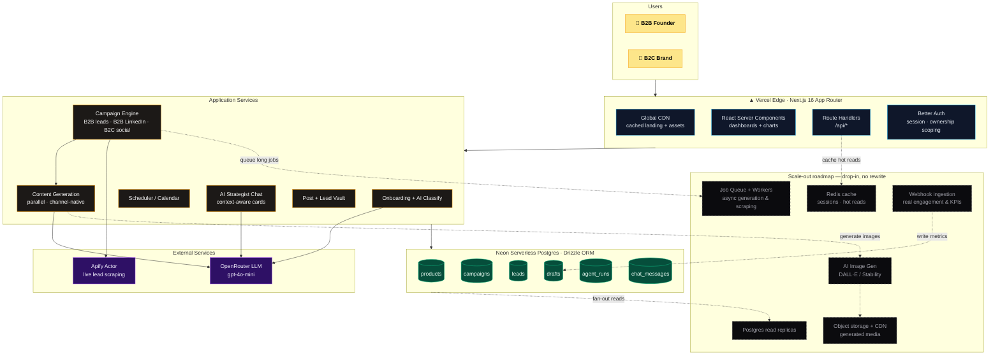

# Reachly — System Architecture (Poster)

> AI-powered growth platform for B2B **and** B2C products: one onboarding → lead scraping,
> channel-native content generation, scheduling, and an AI strategist — on a serverless stack
> that scales out without a rewrite.

**Why it scales (talk track):**
- **Stateless serverless** — Next.js handlers + Neon HTTP driver scale horizontally per-request; no servers to manage.
- **Ownership-scoped data** — every query is filtered by `products.ownerId`, so multi-tenancy is built in.
- **`agent_runs` table is the async seam** — today work runs inline; tomorrow the same records back a **job queue + workers** with zero schema change.
- **Provider-agnostic AI** — OpenRouter means swapping or load-balancing models is a config change.
- **Media path is ready** — `drafts.mediaUrl` / `imagePrompt` already exist, so real **image generation + object storage/CDN** drop in.
- **Real metrics later** — **webhook ingestion** populates `drafts.engagements` & `leads.kpiData`; **read replicas** + **Redis** absorb dashboard read load.
